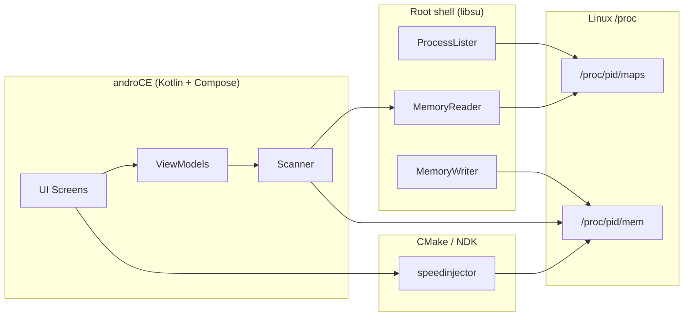

<div align="center">

```
      ___           _            ______
     /   |  ___    | |__   ___  / ____/___  _________
    / /| | / _ \   | '_ \ / _ \/ /   / __ \/ ___/ __/
   / ___ |/ (_) |  | | | |  __/ /___/ /_/ / /  / /_
  /_/  |_|\___/   |_| |_|\___/\____/\____/_/   \__/
```

# androCE

**Android Cheat Engine** — scan, edit, freeze, and speed-hack live process memory on rooted devices.

<br>

[](https://developer.android.com/)
[](https://kotlinlang.org/)
[](https://developer.android.com/jetpack/compose)
[]()
[](https://github.com/sayfpack13/androCE/blob/main/README.md)
[](https://github.com/sayfpack13/androCE/stargazers)

[Features](#-features) · [Quick start](#-quick-start) · [How it works](#-how-it-works) · [Structure](#-project-structure)

</div>

---

## ✨ Overview

**androCE** is a native Android memory toolkit for developers, reverse engineers, and security researchers. Attach to any running process, hunt values across readable `/proc/[pid]/maps` regions, refine results with Cheat Engine–style comparisons, edit addresses in place, freeze values, save cheat tables, and inject a native speed multiplier — all from a dark Material 3 UI tuned for OLED displays.

> **Heads up:** Root access is mandatory. Use only on devices and apps you own or are authorized to test.

---

## 🚀 Features

<table>
<tr>
<td width="50%" valign="top">

### Memory engine

| | |
|---|---|
| 🔎 | **Process browser** — live PID list with search & filter |
| 🧠 | **First + refined scans** — chunked reads over all readable maps |
| 🎯 | **11 value types** — Byte → Long, Float/Double, UTF-8/16 strings, hex arrays, XOR Int/Long |
| 🃏 | **Wildcards** — `??` in byte-array patterns |
| 📊 | **Refined comparisons** — exact, changed, increased/decreased, between, and more |
| ✏️ | **Inline edit** — tap any hit to rewrite memory |
| 📋 | **Bulk write** — apply one value to many addresses |
| ❄️ | **Freeze** — foreground service re-writes values every 100 ms |
| 💾 | **Cheat tables** — save & reload address lists as JSON |

</td>
<td width="50%" valign="top">

### App experience

| | |
|---|---|
| ⚡ | **Speed hack** — native `speedinjector` injected per ABI (0.1×–10×) |
| 🌑 | **Cyberpunk UI** — purple `#A67FFF` + cyan `#26E8FF` on deep OLED black |
| 📱 | **Bottom nav** — Processes · Search · Results · Speed · Settings |
| 🔧 | **Region filters** — narrow scans to useful map segments |
| 🔄 | **Refresh** — re-read live values for current results |
| 📡 | **WLAN deploy** — `adb-wlan.conf` + `build-and-deploy.bat` for wireless debugging |

</td>
</tr>
</table>


## ⚡ Quick start

### Requirements

- **Android 8.0+** (API 26+)
- **Root** — Magisk, KernelSU, or equivalent
- **ADB** for install (USB or wireless debugging)

### Build & run

**Android Studio** — open the repo, sync Gradle, run on a rooted device.

**Command line:**

```bash
git clone https://github.com/sayfpack13/androCE.git
cd androCE
./gradlew assembleDebug
adb install -r app/build/outputs/apk/debug/app-debug.apk
```

**Windows one-liner** — build, install, launch, and stream logs:

```batch
build-and-deploy.bat
```

Wireless ADB: edit `adb-wlan.conf` with your phone's `IP:PORT`, then:

```batch
build-and-deploy.bat
```

Or pass the address directly: `build-and-deploy.bat 192.168.1.42:5555`

---

## 🔬 How it works



| Layer | Role |
|---|---|
| **Maps parser** | Enumerates readable regions from `/proc/[pid]/maps` |
| **Chunked reader** | Reads memory in 4 MB blocks to stay within heap limits |
| **Writer** | Python `lseek`/`write` via root shell, with `dd` fallback |
| **Freeze service** | Bound foreground service; coroutine loop every 100 ms |
| **Speed injector** | Per-ABI native binary staged under `assets/injectors/` |

---

## 🛠 Tech stack

| | Library | Purpose |
|---|---|---|
|  | 2.0.21 | App logic |
|  | BOM 2025.04 | Material 3 UI |
|  | 5.2.2 | Persistent root shell |
|  | 1.8.1 | Scanning & freeze loops |
|  | — | `speedinjector` native build |


## ⚠️ Disclaimer

androCE is for **education, debugging, and authorized security research** only.  
I am not not responsible for misuse.

---

## 📄 License

MIT © [androCE contributors](https://github.com/sayfpack13/androCE)

<div align="center">

<br>

**If this project helps you, consider starring the repo.**

</div>
